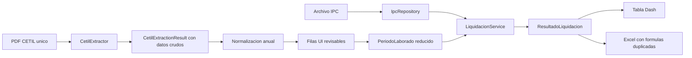

# CETILIA — especificación de descubrimiento del motor actual

**Fecha del descubrimiento:** 2026-08-13
**Fase:** 3 — especificación técnica, sin cambios productivos
**Checkout inspeccionado:** `chore/cetilia-regression-baseline`
**Commit inspeccionado:** `c3bfc29d5ee99f51ebf6afa6971e1797a732cad0`
**Origen del checkout local:** `https://github.com/Davincce/AppIndemnizaciones.git`

> **Límite de esta especificación.** Este documento describe el comportamiento observable del
> checkout indicado y propone contratos de datos para un motor futuro. No afirma que las fórmulas,
> constantes, clasificaciones o resultados actuales sean jurídicamente correctos. No define reglas
> jurídicas nuevas y no autoriza inferencias jurídicas desde el texto de un CETIL.

La referencia solicitada para el análisis fue `Javiervalenciam/AppIndemnizaciones`, pero el remoto
del checkout local inspeccionado es `Davincce/AppIndemnizaciones`. Se documenta la discrepancia; no
se cambió el remoto ni se compararon repositorios remotos.

## Resumen ejecutivo

El motor legado recibe únicamente periodos laborales ya revisados, un histórico IPC normalizado y
una configuración matemática. No recibe a la persona, el PDF CETIL, el régimen, la AFP, la entidad
responsable del pago, la historia de traslados ni una clasificación de tiempo cotizado. La UI y el
normalizador reducen los datos extraídos del CETIL a `fecha_inicio`, `fecha_fin`, `anio`,
`ibl_reportado`, `cargo`, `entidad` y `fuente` antes de llamar al motor.

El cálculo actual puede caracterizarse así:

```text
periodos revisados + histórico IPC + configuración
    -> días por fila
    -> semanas, IPC inicial/final, IBC mensual y semanal por fila
    -> total_dias, SC, SBC, PPC e ISV
```

Los principales límites para CETILIA son:

1. `fecha_liquidacion` existe en la firma, pero se ignora; el IPC final es siempre el último registro
   válido del archivo, incluso si es futuro.
2. El SBC es un promedio simple por fila, no ponderado por duración; dividir un año en varias filas
   cambia el peso de ese año.
3. El PPC es un único valor global (`0.0227`), no una regla efectiva por fecha o periodo.
4. El extractor obtiene datos potencialmente útiles sobre aportes, fondo, tipo de empleado y entidad
   responsable, pero esos campos no llegan al motor.
5. Python y Excel implementan por separado las fórmulas. La UI además vuelve a fijar `0.0227` para la
   celda visual de cada periodo.
6. La aritmética interna usa `Decimal` con precisión global 28 y sin cuantización intermedia. La UI y
   el Excel sí redondean o convierten al presentar/exportar.

---

## A. Contrato del motor legado

### A.1 Frontera real del motor

La frontera ejecutable está en
`src/app_indemnizaciones/services/liquidacion_service.py:18-105`.

| Elemento | Contrato actual |
| --- | --- |
| Servicio | `LiquidacionService(ipc_repository, config=None)` |
| Operación | `calcular(periodos, fecha_liquidacion=None, day_count=None)` |
| Entrada principal | `list[PeriodoLaborado]`; la lista no puede estar vacía. |
| Periodo mínimo | `fecha_inicio: date`, `fecha_fin: date`, `ibl_reportado: Decimal`; `anio`, `cargo`, `entidad` y `fuente` son opcionales. |
| IPC | `IpcRepository` con por lo menos un `IpcRegistro(periodo, fecha, indice)`. |
| Configuración | `CalculationConfig`; en ejecución se consumen `ppc` y `default_day_count`. `weeks_per_year` y `months_per_year` no son consumidos por el servicio. |
| Fecha de liquidación | Parámetro opcional aceptado y pasado a `_calcular_periodo()`, pero no leído al seleccionar IPC. |
| Convención de días | `commercial_360` por defecto; `calendar` es alternativa programática. La UI no expone la selección. |
| Salida | `ResultadoLiquidacion` con detalle por periodo y totales `total_dias`, `sc`, `sbc`, `ppc`, `isv`. |
| Precisión | Contexto global de `Decimal` con precisión 28; no hay `quantize()` dentro del motor. |
| Errores bloqueantes | Lista vacía; fecha final anterior a inicial; IBL menor o igual a cero; convención de días desconocida; IPC inicial anual inexistente; histórico IPC vacío/inválido. |
| Elementos que no conoce | Persona, número o hash CETIL, múltiples documentos, régimen, AFP, traslado, estado de cotización, entidad pagadora, revisión humana, versiones de regla/dataset o auditoría. |

### A.2 Flujo actual completo y dependencia de la UI



La llamada productiva está en `ui/callbacks.py:229-280`. Construye el repositorio IPC desde el
`dcc.Store`, convierte las filas validadas a `PeriodoLaborado` y llama
`LiquidacionService(repo).calcular(periodos)` sin `fecha_liquidacion` ni `day_count`.

La carga de un nuevo CETIL reemplaza `cetil-store` y limpia periodos y resultado
(`ui/callbacks.py:75-121`). Por ello la UI actual representa un solo CETIL activo, aunque un documento
pueda contener varios periodos.

### A.3 Fórmulas observadas

Estas expresiones son descripciones del legado, no reglas jurídicas aprobadas:

```text
dias_fila = commercial_360_days(fecha_inicio, fecha_fin)
             o calendar_days(fecha_inicio, fecha_fin)
semanas_fila = Decimal(dias_fila) / Decimal(7)
ipc_inicial_fila = promedio simple de IPC mensuales validos del anio de la fila
ipc_final_fila = indice del ultimo periodo YYYY-MM valido del repositorio
ibc_actualizado_fila = ibl_reportado * (ipc_final_fila / ipc_inicial_fila)
ibc_semanal_fila = ibc_actualizado_fila / Decimal("4.345")
total_dias = suma(dias_fila)
SC = Decimal(total_dias) / Decimal(7)
SBC = suma(ibc_semanal_fila) / numero_de_filas
PPC = Decimal(str(config.ppc))
ISV = SBC * SC * PPC
```

`commercial_360_days()` implementa actualmente:

```text
d1 = min(dia_inicio, 30)
d2 = dia_fin
si d1 == 30 y d2 == 31: d2 = 30
dias = (anio_fin - anio_inicio) * 360
     + (mes_fin - mes_inicio) * 30
     + (d2 - d1)
```

No suma un día. La línea base congela, entre otros bordes, un periodo de un día con cero días, el
borde 30/31 con cero días y comportamientos específicos de febrero.

### A.4 Precisión, redondeo y serialización

| Superficie | Comportamiento actual |
| --- | --- |
| Motor | `Decimal`, precisión 28, sin redondeo intermedio. `ppc` nace como `float` de configuración y se convierte mediante `Decimal(str(...))`. |
| Store Dash | Fechas ISO y `Decimal` como `str`; `services/serialization.py` evita convertir los resultados a `float`. |
| UI | Dinero se cuantiza a `Decimal("0.01")`; semanas se muestran con 2 decimales; IPC con 2; PPC como porcentaje con 3. Es presentación, no realimenta el cálculo. |
| Excel | Dinero se cuantiza a centavos y luego se convierte a `float`; semanas, PPC e IPC se convierten a `float` sin cuantización explícita. Las celdas incluyen fórmulas y valores cacheados. |

---

## B. Matriz completa de variables actuales

Las referencias de prueba indican qué comportamiento se congela hoy. “Congela” no significa
“valida jurídicamente”.

| Variable | Archivo y función | Entrada | Transformación actual | Salida | Constantes | Redondeo | Dependencias | Prueba que la congela |
| --- | --- | --- | --- | --- | --- | --- | --- | --- |
| **SBC** | `services/liquidacion_service.py:23-57`, `LiquidacionService.calcular()` | `ibc_semanal_actualizado` de todas las filas; número de filas | Promedio aritmético simple por fila: suma / `len(resultados)`. No pondera días ni semanas. | `ResultadoLiquidacion.sbc: Decimal` | Divisor dinámico = número de filas | Ninguno interno; UI/Excel a centavos | IBL, IPC inicial/final, divisor semanal, segmentación/anualización y cantidad de filas | `test_liquidacion_service.py::test_liquidacion_calcula_sbc_sc_y_aportes_sin_redondeo_intermedio`; oráculo completo `test_cetilia_liquidacion_regression.py`; Excel `test_cetilia_excel_regression.py` |
| **SC** | `services/liquidacion_service.py:23-57`, `calcular()` | Suma de `dias` de todas las filas | `Decimal(total_dias) / Decimal(7)` | `ResultadoLiquidacion.sc: Decimal` | `7` días por semana | Ninguno interno; UI muestra 2 decimales; Excel conserva `float` cacheado | Convención de días, duplicados y solapamientos no bloqueantes | `test_liquidacion_service.py::test_liquidacion_calcula_sbc_sc_y_aportes_sin_redondeo_intermedio`; `test_cetilia_period_characterization.py` (duplicados); oráculo completo |
| **PPC** | `config.py:9-14`, `CalculationConfig`; `liquidacion_service.py:23-57`, `calcular()` | `config.ppc: float`, por defecto `0.0227` | `Decimal(str(self.config.ppc))`; un único valor para todo el cálculo | `ResultadoLiquidacion.ppc: Decimal` | `0.0227` | Ninguno interno; UI lo presenta como porcentaje; Excel `float` | Configuración de servicio. No depende de fecha, régimen o periodo. | `test_liquidacion_service.py::test_liquidacion_calcula_sbc_sc_y_aportes_sin_redondeo_intermedio`; oráculo completo; Excel regression |
| **IPC inicial** | `services/ipc_loader.py:196-220`, `get_annual_average_ipc_info()`; consumido en `liquidacion_service.py:59-105` | Año explícito de `PeriodoLaborado` o año de `fecha_inicio`; registros IPC válidos del año | Deduplica por mes conservando el último registro válido; promedio simple de meses disponibles con índice positivo. Permite menos de 12 y emite advertencia. | Por fila: `ipc_inicial`, texto `PROMEDIO ANUAL {anio}`, meses usados y advertencias | `12` como expectativa de año completo | Ninguno interno | Parser IPC, normalización de periodo, año de la fila, disponibilidad del dataset | `test_liquidacion_service.py::test_liquidacion_usa_ipc_promedio_anual_como_ipc_inicial`; `test_ipc_loader.py`; `test_cetilia_ipc_characterization.py`; oráculo completo |
| **IPC final** (`ipc_actual` en código) | `services/ipc_loader.py:190-194`, `ultimo_registro()`/`get_current_ipc()`; consumido en `liquidacion_service.py:79-94` | Todos los registros IPC normalizados | Ordena por `periodo` `YYYY-MM` y toma el último. Acepta futuros. Ignora `fecha_liquidacion`. | Por fila: `periodo_ipc_actual`, `ipc_actual`; metadata Excel `ipc_actual/final` | Sin constante numérica; estrategia “último válido” | Ninguno interno | Parser y dataset IPC; orden lexicográfico válido por formato `YYYY-MM` | `test_cetilia_ipc_characterization.py::test_current_behavior_ipc_last_record_is_latest_period_not_input_order`, `::test_current_behavior_ipc_future_record_becomes_current`, `::test_known_bug_fecha_liquidacion_uses_latest_ipc_instead_of_requested_date`; oráculo completo |
| **IBL** (`ibl_reportado`) | Contrato: `domain/models.py:16-24`; parseo: `period_normalizer.py:52-83`; extracción sugerida: `cetil_extractor.py:705-754`; validación: `utils/validators.py:29-64`; motor: `_calcular_periodo()` | Cadena editable de UI o valor sugerido del CETIL; opcionalmente año de factor salarial | UI normaliza formatos monetarios a `Decimal`. Extractor propone la moda positiva de `ASIGNACIÓN BÁSICA MENSUAL`; si no existe, intenta `Total Devengado`; empate produce `None`; atípicos producen advertencia. El motor solo exige `> 0` y lo usa como entrada. | `PeriodoLaborado.ibl_reportado` y `ResultadoPeriodo.ibl_reportado`, ambos `Decimal` | Expectativa de 12 valores mensuales en extracción, no una fórmula de IBL aprobada | Ninguno en motor; UI/Excel muestran o exportan centavos | Revisión humana, parser monetario, factores por año, anualización CETIL | `test_cetil_extractor.py` (valores mensuales, moda, fallback estructural y multipágina); `test_period_normalizer.py`; `test_period_validators.py`; `test_excel_base_regression.py`; oráculo completo |
| **IBC actualizado** | `services/liquidacion_service.py:81`, `_calcular_periodo()` | IBL, IPC final, IPC inicial | `ibl_reportado * (ipc_actual.indice / ipc_inicial_info.average)` | `ResultadoPeriodo.ibc_actualizado: Decimal` | Ninguna adicional | Ninguno interno; UI/Excel a centavos | IBL e IPC inicial/final | `test_liquidacion_service.py` (tres pruebas); `test_excel_base_regression.py`; oráculo completo; Excel regression |
| **IBC semanal** | `config.py:6`; `liquidacion_service.py:82`, `_calcular_periodo()` | IBC actualizado | `ibc_actualizado / Decimal("4.345")` | `ResultadoPeriodo.ibc_semanal_actualizado: Decimal` | `4.345` | Ninguno interno; UI/Excel a centavos | IBC actualizado y divisor mensual/semanal | `test_liquidacion_service.py`; `test_excel_base_regression.py`; oráculo completo; fórmulas Excel regression |
| **días** | `utils/dates.py:44-59`, `commercial_360_days()`/`calendar_days()`; selección en `liquidacion_service.py:70-76` | `fecha_inicio`, `fecha_fin`, `day_count` | Comercial 360 aproximado descrito en A.3 o diferencia calendario `(end-start).days`; no incluye el día final como suma adicional | `ResultadoPeriodo.dias: int`; suma en `total_dias` | `30`, `31`, `360`; configuración `commercial_360` | No aplica | Fechas, convención seleccionada; duplicados/solapamientos se calculan por separado y se suman | Oráculo de 8 casos en `test_cetilia_liquidacion_regression.py`; `test_liquidacion_service.py`; `test_excel_base_regression.py`; caracterización de periodos |
| **semanas** | `services/liquidacion_service.py:80`, `_calcular_periodo()` | Días de la fila | `Decimal(dias) / Decimal(7)` | `ResultadoPeriodo.semanas: Decimal` | `7` | Ninguno interno; UI muestra 2 decimales; Excel formato 3 decimales pero valor cacheado `float` | Días | `test_excel_base_regression.py`; oráculo completo; Excel regression |
| **fecha_liquidacion** | Firma en `services/liquidacion_service.py:23-35` y `:59-64` | `object | None` programático; la UI no tiene campo ni lo pasa | Se reenvía a `_calcular_periodo()` y queda sin uso. No limita el histórico IPC ni selecciona mes. | Ninguna salida propia; el efecto observado es nulo | Ninguna | No aplica | Actualmente ninguna, por defecto no consumido | `test_cetilia_ipc_characterization.py::test_known_bug_fecha_liquidacion_uses_latest_ipc_instead_of_requested_date` congela explícitamente el defecto |

### B.1 Contratos auxiliares que afectan la matriz

- `IpcRepository.from_dataframe()` ignora filas inválidas, índices no positivos y notas; conserva el
  último registro válido por mes.
- El texto IPC `"155,73"` se convierte actualmente en `Decimal("15573")`; es un bug congelado.
- Si `PeriodoLaborado.anio` existe, prevalece sobre el año de `fecha_inicio` para el IPC inicial.
- Duplicados y solapamientos producen advertencias, pero las filas pasan al motor y se suman.
- Segmentos CETIL contiguos del mismo año se consolidan; brechas mantienen varias filas. Esto afecta
  el SBC porque cada fila tiene el mismo peso.
- La anualización legada 1987–1988 pierde un tramo conocido; la especificación solo lo registra.

---

## C. Modelo de datos canónico propuesto para CETILIA

### C.1 Convenciones de tipos

La propuesta es documental; no se crean clases Python en esta fase.

| Concepto | Tipo propuesto |
| --- | --- |
| Identificadores internos | `UUID` |
| Importes monetarios | `Decimal` sin conversión intermedia a `float` |
| Porcentajes, tasas, pesos y confianza | `Decimal` |
| Fechas civiles | `date` |
| Instantes de auditoría | `datetime` con zona horaria |
| Colecciones inmutables de dominio | `tuple[T, ...]` en la frontera del motor |
| Estados cerrados | `Enum` versionado |
| Campos desconocidos | `T | None`; nunca cero, cadena vacía o falso inventado |
| Evidencia flexible | JSON tipado/versionado, separado del modelo normalizado |

Tipos auxiliares documentales:

- `SourceRef`: `document_id: UUID`, `page: int | None`, `table_index: int | None`,
  `row_index: int | None`, `field_name: str | None`, `locator: str`, `value_hash: str`.
- `ReviewState`: `PENDING`, `CONFIRMED`, `CORRECTED`, `REJECTED`.
- `TimeClassification`: `COTIZADO`, `PUBLICO_NO_COTIZADO`, `PUBLICO_COTIZADO`, `DESCONOCIDO`.
- `VersionId`: identificador inmutable y resoluble de artefacto, por ejemplo semver más hash.
- `HistoryIssue`: registro tipado con `issue_id: UUID`, `issue_type: str`,
  `start_date: date | None`, `end_date: date | None`, `related_period_ids: tuple[UUID, ...]`,
  `status: ReviewState`, `resolution: str | None` y `source_refs: tuple[SourceRef, ...]`.
- `ManualOverride`: registro tipado con `field_path: str`, `previous_value: str | None`,
  `new_value: str`, `reason: str`, `actor_id: str`, `changed_at: datetime` y
  `source_refs: tuple[SourceRef, ...]`.

### C.2 `Person`

| Campo | Tipo | Propósito |
| --- | --- | --- |
| `person_id` | `UUID` | Identidad técnica estable. |
| `document_type` | `str` | Tipo documental confirmado. |
| `document_number` | `str` | Número como identificador, no como entero. |
| `first_name`, `middle_name` | `str | None` | Nombres revisados. |
| `first_surname`, `second_surname` | `str | None` | Apellidos revisados. |
| `full_name` | `str | None` | Valor de presentación confirmado, no clave de unión. |
| `birth_date` | `date | None` | Fecha de nacimiento. |
| `gender` | `str | None` | Dato fuente, sin uso jurídico implícito. |
| `source_refs` | `tuple[SourceRef, ...]` | Evidencia de cada documento. |
| `review_state` | `ReviewState` | Estado de revisión humana. |
| `created_at`, `updated_at` | `datetime` | Auditoría del registro. |

### C.3 `CetilDocument`

| Campo | Tipo | Propósito |
| --- | --- | --- |
| `cetil_document_id` | `UUID` | Identidad interna del documento. |
| `person_id` | `UUID` | Persona a la que se asocia tras verificación. |
| `cetil_number` | `str | None` | Número certificado. |
| `issued_on` | `date | None` | Fecha de expedición. |
| `issued_city` | `str | None` | Ciudad de expedición. |
| `certifying_entity` | `str | None` | Entidad certificadora. |
| `employer_entity_name` | `str | None` | Entidad empleadora declarada a nivel documento. |
| `employer_tax_id` | `str | None` | NIT como identificador textual. |
| `pension_system_effective_on` | `date | None` | Fecha declarada por el documento; no equivale automáticamente a régimen. |
| `source_document_hash` | `str` | SHA-256 del binario exacto. |
| `source_media_type` | `str` | Tipo real verificado. |
| `page_count` | `int` | Control y localización. |
| `extraction_version` | `VersionId` | Versión exacta del extractor. |
| `extracted_at` | `datetime` | Instante de extracción. |
| `extraction_confidence` | `Decimal | None` | Confianza del documento, separada de cada campo. |
| `warnings` | `tuple[str, ...]` | Advertencias no interpretadas como decisión. |
| `review_state` | `ReviewState` | Revisión manual obligatoria. |
| `raw_extraction_ref` | `str` | Referencia segura a extracción inmutable; no obliga a guardar PII en logs. |

### C.4 `EmploymentPeriod`

| Campo | Tipo | Propósito |
| --- | --- | --- |
| `employment_period_id` | `UUID` | Identidad del periodo/vinculación. |
| `person_id` | `UUID` | Persona. |
| `cetil_document_id` | `UUID` | Documento fuente. |
| `linkage_key` | `str | None` | Identificador de vinculación dentro del documento o revisión. |
| `start_date`, `end_date` | `date` | Rango civil confirmado. |
| `linkage_type` | `str | None` | `tipo_vinculacion` fuente. |
| `employee_type` | `str | None` | `tipo_empleado` fuente. |
| `position_title` | `str | None` | Cargo. |
| `employer_entity` | `str | None` | Entidad empleadora del periodo. |
| `responsible_entity` | `str | None` | Entidad responsable declarada, sin atribución jurídica automática. |
| `declared_days` | `int | None` | Días informados por fuente. |
| `declared_interruption` | `str | None` | Interrupción declarada. |
| `high_risk_position` | `str | None` | Campo fuente. |
| `full_time` | `str | None` | Campo fuente sin normalización jurídica. |
| `weekly_hours` | `Decimal | None` | Horas declaradas. |
| `time_classification` | `TimeClassification` | Clasificación confirmada o `DESCONOCIDO`. |
| `source_refs` | `tuple[SourceRef, ...]` | Evidencia por campo. |
| `confidence` | `Decimal | None` | Confianza del periodo. |
| `requires_review` | `bool` | Bloqueo de uso cuando falta revisión. |
| `review_state` | `ReviewState` | Resultado de revisión. |

### C.5 `SalaryPeriod`

| Campo | Tipo | Propósito |
| --- | --- | --- |
| `salary_period_id` | `UUID` | Identidad del tramo salarial. |
| `employment_period_id` | `UUID | None` | Vinculación asociada si puede determinarse. |
| `cetil_document_id` | `UUID` | Documento fuente. |
| `start_date`, `end_date` | `date` | Vigencia del valor; permite mes o tramo parcial. |
| `year`, `month` | `int`, `int | None` | Índices de consulta, no reemplazan fechas. |
| `concept_code` | `str | None` | Código normalizado del concepto. |
| `concept_label` | `str` | Texto fuente, por ejemplo asignación o total devengado. |
| `periodicity` | `str | None` | Periodicidad declarada. |
| `amount` | `Decimal | None` | Importe del concepto. |
| `base_salary_amount` | `Decimal | None` | Valor explícito, no inferido. |
| `total_earned_amount` | `Decimal | None` | Total explícito, no inferido. |
| `currency` | `str | None` | Moneda identificada; `None` si la fuente no permite confirmarla. |
| `source_refs` | `tuple[SourceRef, ...]` | Evidencia. |
| `confidence` | `Decimal | None` | Confianza del campo/tramo. |
| `requires_review` | `bool` | Revisión obligatoria si hay ausencia, empate o atípico. |
| `review_state` | `ReviewState` | Estado de revisión. |

### C.6 `ContributionPeriod`

| Campo | Tipo | Propósito |
| --- | --- | --- |
| `contribution_period_id` | `UUID` | Identidad del tramo contributivo. |
| `employment_period_id` | `UUID | None` | Vinculación relacionada. |
| `start_date`, `end_date` | `date` | Vigencia exacta. |
| `time_classification` | `TimeClassification` | Clasificación explícita/revisada. |
| `pension_contribution_declared` | `str | None` | Valor textual de `aportes_pension`. |
| `administrator_name` | `str | None` | Fondo/AFP/administradora declarada. |
| `contribution_base` | `Decimal | None` | Base monetaria explícita. |
| `contribution_rate` | `Decimal | None` | Tasa aplicable identificada por regla, no hardcodeada. |
| `employee_rate`, `employer_rate` | `Decimal | None` | Componentes si la fuente/regla los distingue. |
| `contribution_amount` | `Decimal | None` | Importe comprobado o calculado, con origen explícito. |
| `days` | `int | None` | Días del tramo según convención versionada. |
| `weeks` | `Decimal | None` | Semanas derivadas, con precisión/versionado. |
| `source_refs` | `tuple[SourceRef, ...]` | Evidencia documental o manual. |
| `confidence` | `Decimal | None` | Confianza. |
| `requires_review` | `bool` | Revisión. |
| `applied_rule_ids` | `tuple[str, ...]` | Reglas que originaron tasa/resultado. |

### C.7 `PensionContext`

| Campo | Tipo | Propósito |
| --- | --- | --- |
| `pension_context_id` | `UUID` | Identidad del contexto. |
| `person_id` | `UUID` | Persona. |
| `as_of_date` | `date` | Fecha a la cual se afirma el contexto. |
| `regime` | `str | None` | Régimen confirmado. |
| `administrator_name` | `str | None` | AFP/administradora confirmada. |
| `administrator_id` | `str | None` | Identificador estable si existe catálogo. |
| `transfer_date` | `date | None` | Fecha efectiva de traslado confirmada. |
| `previous_regime` | `str | None` | Contexto anterior, si aplica. |
| `responsible_entity` | `str | None` | Entidad señalada por fuente/decisión, no inferida. |
| `public_service_effective_on` | `date | None` | Fecha fuente relevante, separada de la fecha de traslado. |
| `source_refs` | `tuple[SourceRef, ...]` | Evidencia. |
| `confidence` | `Decimal | None` | Confianza. |
| `requires_review` | `bool` | Revisión antes de decisión. |
| `review_state` | `ReviewState` | Estado. |

### C.8 `NormalizedHistory`

| Campo | Tipo | Propósito |
| --- | --- | --- |
| `normalized_history_id` | `UUID` | Identidad inmutable de la versión de historia. |
| `person_id` | `UUID` | Persona. |
| `cetil_document_ids` | `tuple[UUID, ...]` | Soporta múltiples CETIL. |
| `employment_periods` | `tuple[EmploymentPeriod, ...]` | Vinculaciones normalizadas. |
| `salary_periods` | `tuple[SalaryPeriod, ...]` | Historia salarial. |
| `contribution_periods` | `tuple[ContributionPeriod, ...]` | Historia contributiva. |
| `pension_context_id` | `UUID | None` | Contexto pensional confirmado. |
| `gaps` | `tuple[HistoryIssue, ...]` | Brechas detectadas con rangos y evidencia. |
| `overlaps` | `tuple[HistoryIssue, ...]` | Solapamientos sin resolución silenciosa. |
| `conflicts` | `tuple[HistoryIssue, ...]` | Valores contradictorios entre documentos. |
| `normalization_version` | `VersionId` | Algoritmo exacto. |
| `normalized_at` | `datetime` | Instante. |
| `input_snapshot_hash` | `str` | Hash del conjunto de extracciones/revisiones. |
| `requires_review` | `bool` | Impide cálculo definitivo si quedan conflictos definidos como bloqueantes. |

### C.9 `CalculationInput`

| Campo | Tipo | Propósito |
| --- | --- | --- |
| `calculation_input_id` | `UUID` | Identidad de entrada inmutable. |
| `person_id` | `UUID` | Persona. |
| `normalized_history_id` | `UUID` | Historia exacta. |
| `liquidation_date` | `date` | Fecha de corte explícita y obligatoria para la versión futura. |
| `selected_employment_period_ids` | `tuple[UUID, ...]` | Alcance elegido. |
| `selected_contribution_period_ids` | `tuple[UUID, ...]` | Alcance contributivo. |
| `pension_context_id` | `UUID` | Contexto usado. |
| `day_count_convention` | `str` | Convención identificada por regla, no literal disperso. |
| `ipc_dataset_version` | `VersionId` | Dataset exacto. |
| `legal_rules_version` | `VersionId` | Reglas jurídicas exactas. |
| `calculation_version` | `VersionId` | Implementación matemática exacta. |
| `decimal_precision` | `int` | Contexto reproducible. |
| `rounding_mode` | `str` | Política explícita. |
| `manual_overrides` | `tuple[ManualOverride, ...]` | Valor previo, nuevo, motivo, actor, instante y evidencia. |
| `created_at` | `datetime` | Instante de cierre de la entrada. |
| `snapshot_hash` | `str` | Hash canónico de todos los campos. |

### C.10 `CalculationResult`

| Campo | Tipo | Propósito |
| --- | --- | --- |
| `calculation_result_id` | `UUID` | Identidad. |
| `calculation_input_id` | `UUID` | Entrada exacta. |
| `period_results` | `tuple[PeriodCalculationRecord, ...]` | Detalle tipado y reproducible por periodo. |
| `total_days` | `int` | Total trazable. |
| `total_weeks` | `Decimal` | Total trazable, sin asumir que se denomina SC en todas las versiones. |
| `sc` | `Decimal | None` | Resultado si la versión de regla lo define. |
| `sbc` | `Decimal | None` | Resultado y estrategia de ponderación asociada. |
| `ppc` | `Decimal | None` | Solo si es global; si varía, queda por periodo. |
| `total_amount` | `Decimal` | Resultado monetario total. |
| `intermediate_values` | `tuple[dict, ...]` | Operandos y resultados de cada paso. |
| `warnings` | `tuple[str, ...]` | Advertencias. |
| `applied_rule_ids` | `tuple[str, ...]` | Reglas realmente ejecutadas. |
| `calculated_at` | `datetime` | Instante. |
| `result_hash` | `str` | Integridad del resultado. |

`PeriodCalculationRecord` debe tener como mínimo:

| Campo | Tipo |
| --- | --- |
| `record_id` | `UUID` |
| `employment_period_ids`, `contribution_period_ids` | `tuple[UUID, ...]` |
| `start_date`, `end_date` | `date` |
| `time_classification` | `TimeClassification` |
| `day_count_convention` | `str` |
| `days` | `int` |
| `weeks` | `Decimal` |
| `salary_amount`, `ibl`, `contribution_base` | `Decimal | None` |
| `contribution_rate`, `ppc`, `sbc_weight` | `Decimal | None` |
| `ipc_initial`, `ipc_final` | `Decimal | None` |
| `ipc_initial_period`, `ipc_final_period` | `str | None` |
| `ibc_updated`, `ibc_weekly`, `contribution_amount` | `Decimal | None` |
| `source_refs` | `tuple[SourceRef, ...]` |
| `applied_rule_ids` | `tuple[str, ...]` |
| `intermediate_values_hash` | `str` |

### C.11 `DecisionResult`

| Campo | Tipo | Propósito |
| --- | --- | --- |
| `decision_result_id` | `UUID` | Identidad de decisión. |
| `calculation_result_id` | `UUID` | Cálculo base. |
| `outcome_code` | `str` | Código versionado; sin catálogo jurídico definido en esta fase. |
| `outcome_label` | `str` | Texto de presentación. |
| `rule_evaluations` | `tuple[RuleEvaluation, ...]` | Regla, hechos de entrada, resultado y explicación. |
| `responsible_entity` | `str | None` | Resultado de una regla externa futura, no de inferencia actual. |
| `amount` | `Decimal | None` | Importe decidido. |
| `requires_review` | `bool` | Necesidad de revisión/aprobación. |
| `review_reasons` | `tuple[str, ...]` | Motivos. |
| `decided_at` | `datetime` | Instante. |
| `decision_version` | `VersionId` | Motor de decisión. |

`RuleEvaluation` debe contener `rule_id: str`, `facts_hash: str`, `outcome: str`,
`explanation: str`, `source_refs: tuple[SourceRef, ...]` y `evaluated_at: datetime`.

### C.12 `AuditTrail`

| Campo | Tipo | Propósito |
| --- | --- | --- |
| `audit_trail_id` | `UUID` | Identidad. |
| `calculation_input_id` | `UUID` | Entrada. |
| `calculation_result_id` | `UUID` | Resultado. |
| `decision_result_id` | `UUID | None` | Decisión, si existe. |
| `source_document_hashes` | `tuple[str, ...]` | Hash de todos los CETIL y anexos. |
| `extraction_version` | `VersionId` | Extractor exacto. |
| `normalization_version` | `VersionId` | Normalizador exacto. |
| `legal_rules_version` | `VersionId` | Reglas exactas. |
| `calculation_version` | `VersionId` | Cálculo exacto. |
| `ipc_dataset_version` | `VersionId` | IPC exacto. |
| `calculated_at` | `datetime` | Instante de cálculo. |
| `input_snapshot_hash`, `result_hash` | `str` | Integridad. |
| `code_artifact_hash` | `str` | Artefacto ejecutado. |
| `events` | `tuple[AuditEvent, ...]` | Extracción, revisión, corrección, cálculo y decisión con actor/instante. |
| `environment` | `EnvironmentSnapshot` | Versión de runtime y parámetros que afecten reproducibilidad. |

`AuditEvent` debe contener `event_id: UUID`, `event_type: str`, `actor_id: str`,
`occurred_at: datetime`, `subject_ref: str`, `before_hash: str | None`, `after_hash: str` y
`reason: str | None`. `EnvironmentSnapshot` debe contener como mínimo `python_version: str`,
`decimal_precision: int`, `rounding_mode: str`, `timezone: str` y `code_artifact_hash: str`.

### C.13 Representación técnica de la clasificación de tiempos

La clasificación debe ser un dato explícito de un tramo, no un efecto lateral del cálculo. Puede
materializarse en `EmploymentPeriod` y `ContributionPeriod` o en una vista tipada derivada llamada
`ClassifiedTimePeriod` con este contrato mínimo:

| Campo | Tipo | Regla de datos |
| --- | --- | --- |
| `classified_time_period_id` | `UUID` | Identidad del tramo clasificado. |
| `classification` | `TimeClassification` | Solo `COTIZADO`, `PUBLICO_NO_COTIZADO`, `PUBLICO_COTIZADO` o `DESCONOCIDO`. |
| `entity` | `str | None` | Entidad asociada y rol conservado fuera de esta cadena. |
| `administrator` | `str | None` | AFP/fondo/administradora confirmada para el tramo. |
| `start_date`, `end_date` | `date` | Rango exacto. |
| `days` | `int | None` | Días con convención y versión identificables. |
| `weeks` | `Decimal | None` | Semanas sin redondeo implícito. |
| `salary` | `Decimal | None` | Importe confirmado para el tramo. |
| `source` | `tuple[SourceRef, ...]` | Documento, página, tabla/fila/campo o evidencia manual. |
| `confidence` | `Decimal | None` | Valor entre 0 y 1; no reemplaza revisión. |
| `requires_review` | `bool` | `True` si falta evidencia, hay conflicto o la clasificación no fue confirmada. |
| `classification_method` | `str` | `MANUAL` o identificador de regla versionada; nunca heurística oculta. |
| `applied_rule_ids` | `tuple[str, ...]` | Vacío para dato fuente/manual sin regla. |

Cuando no exista evidencia o regla externa aprobada, el valor debe ser `DESCONOCIDO` y
`requires_review=True`. No se debe mapear automáticamente `tipo_empleado=PÚBLICO`,
`aportes_pension=SI`, `fondo_aporte` presente o entidad pública a ninguna de las otras tres clases.

---

## D. Información actualmente inexistente o insuficiente

| Necesidad futura | Estado actual | Contrato mínimo requerido | No inferir todavía |
| --- | --- | --- | --- |
| Porcentajes históricos de cotización | No existe tabla efectiva. Solo PPC global. | Registros con `valid_from: date`, `valid_to: date | None`, `rate: Decimal`, componentes, ámbito, fuente normativa y `rule_version`. | Qué porcentaje aplica a una persona o periodo. |
| PPC variable por periodo | No existe; `CalculationConfig.ppc` es único. | Tabla/regla efectiva por fecha con `ppc: Decimal`, condición de aplicabilidad y referencia normativa. Cada resultado debe guardar el PPC aplicado. | Sustituir automáticamente `0.0227`. |
| Ponderación por duración | No existe; SBC promedia filas. | `weighting_strategy`, unidad (`days`, `weeks`, otra), peso por fila, tratamiento de parciales, precisión y regla. | Que duración deba ser el criterio jurídico. |
| Tiempos cotizados | Solo texto crudo `aportes_pension`, `fondo_aporte` y días declarados; se descarta antes del motor. | `ContributionPeriod` con rango, estado, administrador, base/tasa/importe si existen, fuente, confianza y revisión. | Que “SI” o un fondo prueben por sí solos cotización efectiva. |
| Tiempos públicos no cotizados | Sin clasificación canónica. | `EmploymentPeriod.time_classification`, evidencia y decisión humana/regla versionada. | Clasificar por `tipo_empleado=PÚBLICO` o por ausencia de fondo. |
| Régimen pensional | Ausente. La fecha de vigencia del sistema no es un régimen. | `PensionContext.regime`, vigencia, fuente, confianza y revisión. | Régimen a partir de entidad, fecha o texto parcial. |
| AFP | `fondo_aporte` puede extraerse en tabla, pero no llega a UI/motor. | Administradora normalizada con nombre fuente, ID de catálogo, vigencia y evidencia. | Que cualquier texto de fondo sea AFP vigente o única. |
| Fecha de traslado | Ausente. | `transfer_date: date`, régimen/administradora origen y destino, fuente y revisión. | Derivarla de fecha de expedición, vigencia o primer aporte. |
| Entidad responsable | Existe parcialmente por periodo y como entidad empleadora, pero se reduce a una cadena `entidad`; no se conserva el rol. | Entidades separadas por rol: empleadora, certificadora, administradora, responsable declarada y responsable decidida. | Igualar esos roles. |
| Múltiples CETIL | El modelo de resultado puede representar un documento; la UI mantiene un solo `cetil-store` y lo reemplaza. | Colección de `CetilDocument`, unión por persona revisada, reglas de deduplicación/conflicto y procedencia por campo. | Que documentos con datos parecidos correspondan a la misma persona sin revisión. |
| Múltiples vinculaciones | Hay varios periodos, pero no una entidad `linkage` estable; una entidad empleadora global puede coexistir con responsables por fila. | `linkage_key`, entidad/rol por vinculación, rangos, interrupciones, solapamientos, fuente y resolución de conflictos. | Consolidar periodos por cercanía o entidad sin regla. |

---

## E. Datos adicionales que deberá pedir CETILIA

Los siguientes datos no deben inventarse cuando no estén en documentos o fuentes confiables:

1. Fecha de liquidación/corte exacta.
2. Confirmación de identidad cuando varios CETIL deban asociarse a una persona.
3. Todos los CETIL y anexos que integran la historia; indicar si falta alguno.
4. Régimen pensional a la fecha de corte y fuente que lo acredita.
5. AFP/administradora actual e históricas, con fechas de vigencia.
6. Fecha y dirección de cada traslado de régimen o administradora.
7. Confirmación por tramo de tiempo cotizado, público cotizado, público no cotizado o desconocido.
8. Entidad empleadora, certificadora, administradora y eventualmente responsable, diferenciadas por
   rol y periodo.
9. Periodos o vinculaciones faltantes, superpuestos, duplicados o interrumpidos y decisión humana
   sobre cada conflicto.
10. Salario/IBL confirmado por periodo cuando el CETIL no lo permita determinar con confianza.
11. Conceptos salariales que pueden integrar una base; la respuesta debe venir de una regla/fuente
    externa, no de una selección estadística del extractor.
12. Evidencia de cotización, base, tasa e importe cuando el documento solo declare un indicador.
13. Dataset IPC aprobado y su fecha/versión; no solo un archivo subido sin identificación.
14. Versión jurídica y matemática autorizada para el caso.
15. Motivo, actor y evidencia de cualquier corrección manual.

---

## F. Datos extraíbles potencialmente desde CETIL

“Potencialmente” significa que el extractor actual tiene un campo o una ruta de parsing; todos deben
conservar `SourceRef`, confianza y revisión. No significa que estén presentes ni sean confiables en
todos los documentos.

| Grupo | Campos actuales potenciales | Destino canónico | Limitación observada |
| --- | --- | --- | --- |
| Documento | número CETIL, ciudad, fecha de expedición, entidad certificadora | `CetilDocument` | Entidad certificadora es una línea de sección, no entidad normalizada. |
| Persona | tipo/número de documento, nombres, fecha de nacimiento, género | `Person` | Puede faltar o contaminarse por etiquetas; requiere revisión. |
| Entidad empleadora | nombre, NIT, fecha de vigencia del sistema pensional | `CetilDocument`/entidad relacionada | No determina régimen ni responsabilidad. |
| Periodo | fechas desde/hasta, tipo de vinculación, tipo de empleado, cargo | `EmploymentPeriod` | El fallback textual extrae menos columnas que la tabla. |
| Aportes | aportes pensión, salud y riesgos | `ContributionPeriod` como datos declarados | Actualmente solo se llenan desde extracción tabular y no llegan al motor. |
| Administradora | fondo de aporte | `ContributionPeriod.administrator_name` | Texto sin catálogo, vigencia o prueba de afiliación. |
| Responsabilidad | entidad responsable por fila | `EmploymentPeriod.responsible_entity` | No equivale a decisión jurídica de pago. |
| Tiempo | total de días, interrupción, tiempo completo, horas semanales | `EmploymentPeriod`/`ContributionPeriod` | `interrupcion` existe en el modelo, pero la ruta tabular actual no la asigna; días declarados no se contrastan con días calculados. |
| Riesgo | cargo de alto riesgo | `EmploymentPeriod.high_risk_position` | Campo fuente sin regla. |
| Salarios | año, concepto, valores mensuales, asignación básica, total devengado, periodicidad, página | `SalaryPeriod` | El parser actual solo busca dos conceptos y asocia por posición hasta 12 valores. |
| Calidad | página, `raw_text`, texto por página, advertencias, confianza global | Evidencia/AuditTrail | `raw_text` y páginas contienen PII; deben almacenarse de forma segura, no en logs o fixtures públicos. La confianza actual es global y heurística. |

Datos que el CETIL actual no extrae de forma explícita: régimen, fecha de traslado, tasa histórica de
cotización, PPC aplicable, regla de ponderación, decisión de responsabilidad y prueba de pago
efectivo. Aunque palabras relacionadas aparezcan en un documento, se requiere un contrato y una
regla externa antes de convertirlas en esos conceptos.

---

## G. Supuestos matemáticos actuales

1. Precisión `Decimal` global 28.
2. No hay redondeo intermedio en el motor.
3. `commercial_360` es la convención predeterminada y no suma un día.
4. La alternativa calendario también usa diferencia exclusiva: `(end - start).days`.
5. Una semana equivale a 7 días tanto por fila como en SC.
6. IPC inicial es el promedio aritmético simple de los meses válidos disponibles del año.
7. Un año IPC incompleto no bloquea el cálculo.
8. El último periodo IPC válido es el IPC final, incluso si excede `fecha_liquidacion` o está en el
   futuro.
9. IBC actualizado usa la razón IPC final / IPC inicial.
10. IBC semanal usa el divisor `4.345`.
11. SBC es promedio aritmético por fila sin ponderación temporal.
12. Duplicados y solapamientos se calculan y acumulan.
13. PPC es global y constante para todas las filas.
14. ISV es el producto exacto SBC × SC × PPC.
15. Los importes se redondean solo para presentación/exportación; Excel monetario usa centavos y
    `float`.
16. La anualización y consolidación previa pueden alterar cantidad y longitud de filas, por lo tanto
    afectan SBC y días antes de entrar al motor.

---

## H. Constantes peligrosas e inventario de apariciones

### H.1 Leyenda

- **A:** pertenece al motor o a una transformación que alimenta el motor.
- **B:** duplicada en más de un lugar.
- **C:** está en UI.
- **D:** está en Excel/exportación.
- **E:** está únicamente documentada en esa aparición.
- **P:** prueba/oráculo; etiqueta auxiliar. Una prueba no es una regla productiva.
- **CFG:** configuración declarativa no cargada por el runtime observado.

La búsqueda cubrió archivos versionados del repositorio. Se excluyen de este inventario números que
solo son fechas, índices de columna/fila, dimensiones CSS, colores, versiones, conteos de pruebas o
ejemplos de skills vendorizadas, porque no representan constantes o supuestos del cálculo.

### H.2 Inventario numérico y `DAYS360`

| Constante | Apariciones relevantes | Clasificación y riesgo |
| --- | --- | --- |
| `0.0227` | `.kiro/settings.json:16`; `settings.json:16`; `src/app_indemnizaciones/config.py:11`; `liquidacion_service.py:45`; `ui/tables.py:158`; `README.md:79`; `REVIEW.md:25`; `claude.md:33`; fixture dorado `liquidacion_service_baseline.json:48,122,151,180,209,238,267,311`; `test_liquidacion_service.py:98` | `config.py` y servicio: **A/B**; UI: **B/C** y puede divergir de `resultado.ppc`; settings: **B/CFG**; docs: **B/E**; pruebas: **P**. Debe convertirse en regla versionada antes de variar por fecha. |
| `4.345` | `config.py:6`; `excel_exporter.py:115`; `README.md:81`; `test_excel_base_regression.py:72`; `test_excel_exporter.py:96`; `test_liquidacion_service.py:92-93` | Motor **A/B**; Excel **B/D**; README **E**; pruebas **P**. Es la misma relación matemática que `52.14 / 12`, expresada de otra forma. |
| `52.14` | `.kiro/settings.json:17`; `settings.json:17`; `config.py:12`; `claude.md:24` | `config.py` **A** pero actualmente no consumida; settings **B/CFG**; `claude.md` **E**. Riesgo: parece configurable aunque el motor usa `4.345`. |
| `12` | `.kiro/settings.json:18`; `settings.json:18`; `config.py:13`; `claude.md:24`; `ipc_loader.py:204,206`; `cetil_extractor.py:662,674` y lista de meses `cetil_models.py:8-21`; `CETILIA_REGRESSION_BASELINE.md:138`; pruebas de extractor/IPC/normalizador con 12 valores o meses | Config **A** pero no consumida por servicio; IPC/extractor **A/B** como expectativa anual; settings **CFG**; docs **E**; pruebas **P**. No confundir el 12 de meses con posiciones de tabla/Excel o fechas. |
| `360` | `.kiro/settings.json:15`; `settings.json:15`; `config.py:14`; `liquidacion_service.py:70-71`; `utils/dates.py:44-55`; `excel_exporter.py:112` (`DAYS360`); `CAPTAIN.md:22`; `README.md:77`; `REVIEW.md:23`; `claude.md:21`; baseline `:202,287`; pruebas Excel y doradas | Días **A/B**; Excel **B/D**; settings **CFG**; docs **E**; pruebas **P**. La implementación Python se denomina aproximada y no es idéntica por declaración a todas las variantes de DAYS360. |
| `30` | `utils/dates.py:51,53-55`; `excel_exporter.py:112` de forma implícita vía `DAYS360`; baseline `:75,134`; fixture dorado caso `month_30_31`; pruebas doradas/Excel | Motor **A**; Excel **B/D**; docs **E**; pruebas **P**. Los demás `30` del repositorio son fechas, conteos, colores o confianza `0.30`, no constantes de esta fórmula. |
| `7` | `liquidacion_service.py:39,80`; `excel_exporter.py:113`; `README.md:78`; `claude.md:22,31`; pruebas `test_liquidacion_service.py:96`, `test_cetilia_period_characterization.py:97`, Excel regression/exporter | Motor **A/B**; Excel **B/D**; docs **E**; pruebas **P**. Se duplica para semanas de fila y SC. |
| `DAYS360` | `excel_exporter.py:112`; `utils/dates.py:46,48`; `README.md:77`; `claude.md:21`; baseline `:287`; pruebas Excel regression/exporter | Python **A** por implementación análoga; Excel **D**; docs **E**; pruebas **P**. Riesgo de divergencia entre fórmula de Excel y aproximación Python. |

### H.3 Inventario semántico de `PPC`, `SBC`, `IBL` e `IPC`

Para términos con muchas etiquetas, mensajes y pruebas, se agrupan todas las apariciones de un mismo
archivo, conservando las líneas relevantes.

| Término | Motor/normalización (**A**) | UI (**C**) | Excel (**D**) | Documentación (**E**) | Pruebas (**P**) |
| --- | --- | --- | --- | --- | --- |
| `PPC` | `config.py:11`; `liquidacion_service.py:45,47-55`; modelo/serialización `domain/models.py:68`, `serialization.py:73,84` | `ui/tables.py:158,197,204` | `excel_exporter.py:67,158-182` | `README.md:35,79,83`; `REVIEW.md:25`; `claude.md:33-34`; baseline `:65,101,205,267` | fixture dorado; `test_liquidacion_service.py:98-99`; `test_cetilia_liquidacion_regression.py:79`; Excel regression/exporter |
| `SBC` | `domain/models.py:67`; `liquidacion_service.py:40-55`; `serialization.py:72,83` | `ui/tables.py:197,205` | `excel_exporter.py:166-182` | `README.md:35,82-83`; `claude.md:32,34`; baseline `:65,101,145,205,267,286` | `test_liquidacion_service.py:97,99`; oráculo completo; Excel regression/exporter |
| `IBL` | `domain/models.py:19,45`; `cetil_extractor.py:705-754`; `cetil_models.py:92,96,335,349,355`; `period_normalizer.py:21,42,52-83,103-120,139,192,198,219,230`; `validators.py:39-48`; `liquidacion_service.py:67,81,87` | `callbacks.py:171`; `layout.py:118`; `tables.py:27,142,157,178` | `excel_exporter.py:66` | `README.md:33,80,114`; `claude.md:23`; baseline `:48,63,288` | extractor, normalizador, validadores, Excel base, oráculo completo |
| `IPC` | `domain/models.py:27-39,48-51`; `ipc_loader.py:20-237` (carga, deduplicación, promedio, último registro); `liquidacion_service.py:78-99`; serialización `:31-39,53-61` | `callbacks.py:48-73,229-251,335-395`; `components.py:22`; `layout.py:22,30,45-55`; `tables.py:159-181` | `excel_exporter.py:16-44,68-69,219-249` | `AGENTS.md:12,27-28`; `BUILD.md:68,71`; `CAPTAIN.md:9,11,21,27`; `README.md:3,13,20,30,34,36,44,61-62,80,91-94,240,263`; `REVIEW.md:9,13,18`; `claude.md:5,23,37-42`; `docs/ARCHITECTURE.md:31,35`; `docs/IPC_IMPORT.md:1-60`; baseline `:10,44-46,53,63-64,80,138-140,152-157,182,200-205,266,280-282`; `pyproject.toml:4`; settings de esquema | `test_ipc_loader.py`; `test_liquidacion_service.py`; `test_cetilia_ipc_characterization.py`; oráculo completo; Excel regression/exporter; KPI IPC |

---

## I. Duplicaciones entre motor, UI y Excel

| Concepto | Motor | UI | Excel | Riesgo |
| --- | --- | --- | --- | --- |
| PPC | Toma `CalculationConfig.ppc` | La fila de resultado imprime `Decimal("0.0227")`, mientras el KPI usa `resultado.ppc` | Usa `resultado.ppc` y `AVERAGE` de la columna | Si cambia configuración, la tabla por fila puede mostrar un valor distinto al resultado. |
| Días | `commercial_360_days()` aproximado o calendario | Solo presenta resultado | `DAYS360(B,C)` siempre, sin reflejar la alternativa calendario | Fórmula visible puede no corresponder al valor cacheado o a la convención elegida. |
| Semanas/SC | Cada fila `dias/7`; SC `total_dias/7` | Formatea | Fila `D/7`; SC `SUM(E)` | Equivalentes con aritmética actual, pero implementaciones independientes. |
| IBC actualizado | `IBL * (IPC final / IPC inicial)` | Presenta | `F*(I/H)` | Doble implementación y redondeo cacheado a centavos. |
| IBC semanal | Divide por constante de `config.py` | Presenta | Divide por literal `4.345` | Cambio de constante no se propaga automáticamente al Excel. |
| SBC | Promedio de filas | Presenta | `AVERAGE(K...)` | Excel promedia valores de celdas monetarias; el valor cacheado viene cuantizado. |
| ISV | `SBC * SC * PPC` sin redondeo | Presenta centavos | Producto de totales y valor cacheado a centavos | Recalcular el libro puede usar valores mostrados/fórmulas con precisión distinta al cache. |
| IPC final | Último registro | KPI muestra último | Metadata exporta último | Coherente hoy, pero ninguna superficie respeta `fecha_liquidacion`. |
| IBL | Motor consume valor revisado | Editable antes de cálculo | Exporta y cuantiza | El Excel no conserva de forma estructurada la evidencia y decisión que originaron el IBL. |
| Configuración | `config.py` es runtime | No expone convención/fecha | Literales propios | `settings.json` y `.kiro/settings.json` duplican valores, pero no se observó carga productiva. |

---

## J. Puntos que requieren una regla jurídica externa

Antes de codificar una versión jurídica, una fuente autorizada debe resolver como mínimo:

1. Convención de días, inclusión de extremos y tratamiento de febrero/fin de mes.
2. Tratamiento de periodos duplicados, solapados, contiguos, con brechas o interrupciones.
3. Qué tiempos cuentan, cómo se distingue cotizado/no cotizado y cómo se trata tiempo público.
4. Relación entre días declarados en CETIL y días derivados de fechas.
5. Conceptos salariales que integran IBL y tratamiento de variaciones mensuales, parciales y atípicos.
6. IPC inicial aplicable: mensual, promedio anual, año incompleto y meses faltantes.
7. IPC final aplicable según fecha de liquidación, publicación y registros futuros.
8. Porcentajes históricos de cotización y sus componentes por periodo.
9. PPC aplicable y vigencia temporal.
10. Conversión de base mensual a semanal; divisor y precisión.
11. Definición de SBC y eventual ponderación por duración.
12. Efectos del régimen, AFP y traslados sobre reglas y responsabilidad.
13. Tratamiento de múltiples CETIL y múltiples vinculaciones, conflictos y doble conteo.
14. Determinación de entidad responsable y reparto entre entidades, si aplica.
15. Política de redondeo en cada etapa y en el importe final.
16. Criterios de suficiencia documental, revisión humana y bloqueo del cálculo.

---

## K. Propuesta de versionado y trazabilidad

### K.1 Identificadores mínimos obligatorios

Cada cálculo futuro debe guardar exactamente y de forma resoluble:

- `source_document_hash`: uno por cada documento fuente, con algoritmo indicado.
- `extraction_version`: extractor, configuración y artefacto ejecutado.
- `normalization_version`: reglas de limpieza, unión, anualización y clasificación.
- `legal_rules_version`: conjunto inmutable de reglas jurídicas y sus fuentes.
- `calculation_version`: implementación matemática.
- `ipc_dataset_version`: dataset exacto, origen, fecha de corte y hash.
- `calculated_at`: `datetime` con zona horaria.

No basta una cadena libre como “v1”. Cada `VersionId` debe poder resolver un manifiesto inmutable con
semver, hash del artefacto, fecha de vigencia y estado (`draft`, `approved`, `retired`).

### K.2 Datos necesarios para reconstrucción completa

1. Hash y referencia segura al binario exacto de cada CETIL/anexo.
2. Salida cruda estructurada del extractor, localizadores de página/tabla/campo y confianza.
3. Todas las correcciones humanas como eventos append-only: antes, después, motivo, actor, instante y
   evidencia.
4. Snapshot canónico de `Person`, documentos, periodos, salarios, contribuciones y contexto.
5. Conflictos, brechas, solapamientos y decisión adoptada; nunca solo el valor final consolidado.
6. `CalculationInput` completo con fecha de liquidación, periodos seleccionados y overrides.
7. Dataset IPC completo o referencia inmutable verificable, no únicamente los dos índices usados.
8. Identificadores y contenido de las reglas aplicadas a cada fila.
9. Contexto decimal: precisión, modo de redondeo y puntos exactos de cuantización.
10. Todos los operandos y resultados intermedios por fila.
11. Totales y resultado/decisión con hashes canónicos.
12. Versión del runtime, código/imagen ejecutada y configuración efectiva.

### K.3 Invariantes de auditoría propuestos

- Un cálculo nunca muta: una corrección crea nueva versión de historia, entrada y resultado.
- Cada campo derivado señala sus campos fuente y `applied_rule_ids`.
- Cada campo manual conserva evidencia y autoría.
- `requires_review=True` no puede convertirse silenciosamente en aprobado.
- Los hashes se calculan sobre serialización canónica que preserve `Decimal` como texto exacto y
  fechas ISO.
- Los documentos con PII no se incluyen en repositorio, logs ni mensajes; el hash y la referencia
  segura permiten integridad sin exposición.
- Reproducir significa obtener los mismos valores exactos, advertencias y reglas aplicadas, no solo
  el mismo total redondeado.

---

## L. Preguntas antes de escribir el nuevo motor

1. ¿Cuál es la fuente jurídica aprobada y quién aprueba cada `legal_rules_version`?
2. ¿Qué fecha exacta controla IPC final, tasas, PPC, régimen y entidad responsable?
3. ¿Qué convención de días se aplica a cada tipo de tiempo y los extremos son inclusivos?
4. ¿Se usa el día informado por CETIL, el derivado de fechas o una conciliación versionada?
5. ¿Qué evidencia permite clasificar `COTIZADO`, `PUBLICO_NO_COTIZADO` y `PUBLICO_COTIZADO`?
6. ¿Qué debe ocurrir cuando la clasificación sigue `DESCONOCIDO`?
7. ¿Cuál es la tabla histórica de tasas/PPC, su vigencia y ámbito?
8. ¿Cómo se calcula el IBL por periodo y qué conceptos salariales entran?
9. ¿Cómo se tratan meses parciales, salario variable, ceros, ausencias y empates?
10. ¿Cuál es la regla de ponderación del SBC y qué unidad usa?
11. ¿El IPC inicial es mensual, anual u otra referencia, y qué hacer con años incompletos?
12. ¿Qué publicación IPC es válida a la fecha de liquidación y cómo se excluyen futuros?
13. ¿Cómo se resuelven duplicados, solapamientos y conflictos entre múltiples CETIL?
14. ¿Cómo se identifica una vinculación estable entre documentos?
15. ¿Qué efectos tienen régimen, AFP y fecha de traslado?
16. ¿Cómo se determina y versiona la entidad responsable?
17. ¿En qué pasos se redondea, con qué modo y escala?
18. ¿Qué advertencias bloquean cálculo y cuáles solo exigen revisión?
19. ¿Qué datos de extracción pueden persistirse, dónde y con qué controles de PII?
20. ¿Cuál será el oráculo de aceptación del nuevo motor cuando una regla aprobada se aparte de la
    línea base legada?

---

## Apéndice 1. Pruebas que forman el contrato de regresión

| Superficie | Pruebas principales |
| --- | --- |
| Motor exacto | `tests/test_cetilia_liquidacion_regression.py` + `tests/fixtures/regression/liquidacion_service_baseline.json` |
| IPC y fecha | `tests/test_cetilia_ipc_characterization.py`, `tests/test_ipc_loader.py` |
| Fórmulas y totales | `tests/test_liquidacion_service.py`, `tests/test_excel_base_regression.py` |
| Duplicados/solapamientos/anualización | `tests/test_cetilia_period_characterization.py`, `tests/test_period_normalizer.py`, `tests/test_period_validators.py` |
| Extracción CETIL | `tests/test_cetil_extractor.py` y regresión privada local ignorada por Git |
| Excel | `tests/test_cetilia_excel_regression.py`, `tests/test_excel_exporter.py` |
| Frontera UI | `tests/test_ui_tables.py`, `tests/test_download_callbacks.py`, `tests/test_cetil_session_state.py` |
| Serialización | `tests/test_serialization.py` |

La línea base pública y privada, los bugs rotulados y el procedimiento de comparación permanecen en
`docs/CETILIA_REGRESSION_BASELINE.md`. Esta especificación no reemplaza ni actualiza snapshots.

## Apéndice 2. Criterio de salida para una fase de implementación futura

No debería comenzar un nuevo motor hasta que:

1. las preguntas jurídicas de la sección L que afecten cálculo tengan respuesta versionable;
2. los contratos de datos distingan ausente, desconocido, inferido y confirmado;
3. exista un dataset de reglas/tasas e IPC con hashes y vigencias;
4. se definan oráculos para legado y para cada cambio aprobado;
5. la trazabilidad permita reconstruir cada fila y total sin depender de Dash o Excel;
6. la política de PII y conservación de evidencia esté aprobada.
